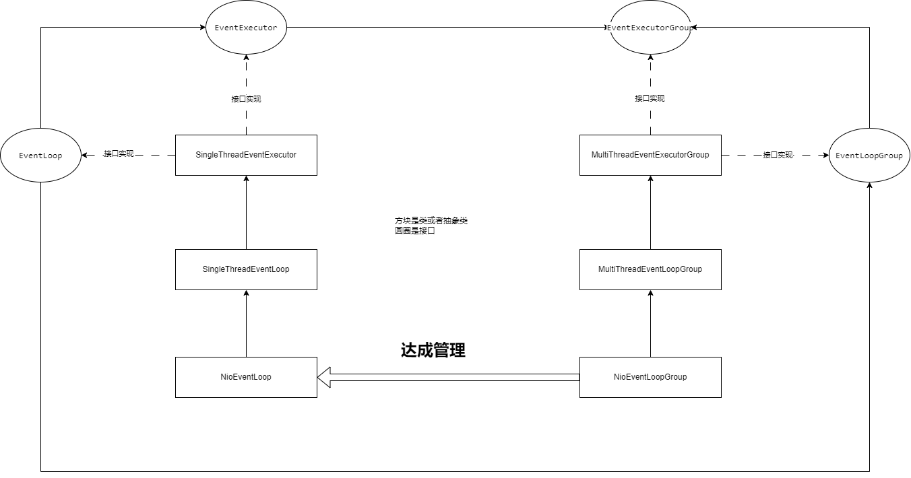

上节课我们讲解了 Reactor 线程模型，知道它的运作是建立在 NioEventLoop、SingleThreadEventLoop 和 SingleThreadEventExecutor 这三个类之上的。这节课，我们将会在这三个类的基础上，引入更多的接口，比如EventLoop、EventExecutor、EventLoopGroup、EventExecutorGroup，以及这些接口的实现类。

并且最终由这些接口和实现类，为大家搭建出一个层次分明的架子，而 Netty 的运转就依靠了这个架子。

如果把所有接口和实现类一下子全摆出来，你大概率会觉得逻辑混乱。

因此，这节课我仍然不会直接讲解源码，而是通过一个小例子，分析其缺点与不足，最终完善出我们想要的接口和实现类。

## 引入 EventLoop 接口
提到 EventLoop 大家的第一印象是什么？事件循环？它的名字翻译过来就是这个意思，好像我们也只能有这个印象了。

我第一次见到这个名称是在 C 语言里面。你可以把 EventLoop 定义成方法的名称，也可以定义成类的名称，后来在 Redis 的源码中也看到了它。

接着又在 Netty 中见到了它。由此可见，EventLoop 并不是 Netty 作者的原创。

上节课我们定义了一个 NioEventLoop 类，类名的后半部分为 EventLoop ，这个类的意思就是 NIO 的事件循环。

可现在我不想关心 NIO 事件了，我开始关心 BIO 的事件，那我是不是就该把 NioEventLoop 改为 BioEventLoop (在 Netty 中并没有这个类，而是 EpollEventLoop、KQueueEventLoop 这样的几个类，在这里使用 BioEventLoop 只是让大家理解起来更容易)？

所以，我就又在我们的代码中搞出来一个 BioEventLoop (这个类的内容暂不实现，因为我们并不是真的要使用它来工作)。
```java
public class BioEventLoop extends SingleThreadEventLoop{

}
```

可以看出，该类也继承了 SingleThreadEventLoop 这个类，查看其顶层父类，我们发现 BioEventLoop 实际上也是一个单线程执行器。现在我们要让这个类在 ServerTest 类中工作，问题就来了。

现在我是想用 BIO 的方式来处理 IO 事件，所以直接在 ServerTest 类中创建一个 BioEventLoop 即可，但将来我要是再次对 NIO 的方式感兴趣了呢？又要修改代码岂不麻烦？
```java
public class ServerTest {
    
        //得到服务端channel
        ServerSocketChannel serverSocketChannel = ServerSocketChannel.open();
        //channel设置成非阻塞的
        serverSocketChannel.configureBlocking(false);
        //得到selector多路复用器
        Selector selector = Selector.open();
        //服务端channel注册到多路复用器上
        SelectionKey selectionKey = serverSocketChannel.register(selector, 0, serverSocketChannel);
        //设置感兴趣事件
        selectionKey.interestOps(SelectionKey.OP_ACCEPT);
        //绑定端口号
        serverSocketChannel.bind(new InetSocketAddress(8080));
        //该创建一个Nio还是Bio线程呢？
        
        ······
   

}
```

这时候，大家肯定建议我使用接口来解耦。既然要定义接口，那接口肯定不能定义在 SingleThreadEventExecutor 之上，因为接口的实现类和 IO 的模式有关。

直接定义在 NioEventLoop 也不合适，因为 NioEventLoop 类还要调用中间父类SingleThreadEventLoop的 register 方法。

那为什么不在接口中直接定义一个 register 方法让 XXXEventLoop 去实现呢？所以我可以把接口定义在 SingleThreadEventLoop 之上，这样接口中既可以定义 register，SingleThreadEventLoop 类本身也已经实现了该方法。

接口的名字我也已经想好了，就叫 EventLoop，像下面这样：
```java
public abstract class SingleThreadEventLoop extends SingleThreadEventExecutor implements EventLoop{
    
   //该方法为EventLoop接口中的重写方法
   @Override
   public void register(SocketChannel channel,NioEventLoop nioEventLoop) {
        nioEventLoop.execute(new Runnable() {
            @Override
            public void run() {
                channel.configureBlocking(false);
                channel.register(nioEventLoop.selector(), SelectionKey.OP_READ);
            }
        }
    }
}
```
你会发现，你可能很难最初就设定好一个接口，让某些类对同一个方法做不同实现，以便在某些地方解耦。更多的情况是你编写了一个类，然后在某个地方突然发现这个类有些死板，需要引入接口，并增添更多的实现类。

所以，我想大家应该也可以理解我的这种马后炮式代码。

## 引入 EventExecutor 接口
但是，我们的代码还有一个问题。SingleThreadEventExecutor 这个类主要是给 NIO 模式下的线程使用的，但在我们的代码中难道就只有 NIO 事件吗？或者说用户只能创建 NIO 线程？

那限制就太大了，如果我的程序中还有很多小任务，执行并不耗时，我可以特意搞一个线程：GlobalEventExecutor，它翻译过来就是全局执行器。

接下来，大家应该都知道了，我应该再给 SingleThreadEventExecutor 搞一个接口。但这里我就不真的引入 GlobalEventExecutor 这个类了，我直接把接口搞出来给你们看。

好的，我就把这个接口起名为 EventExecutor(当然，在源码中，EventExecutor 接口肯定是要继承 Executor 接口的，否则线程池的身份就不满足了，这里就先不按照源码改造了，大家知道即可)。里面的方法我们暂且不定义。
```java
public abstract class SingleThreadEventExecutor implements EventExecutor,Executor{

        @Override
        public void execute(Runnable task) {
        //把任务添加到任务队列，该方法很简单就不再列出来了。
        addTask(task);
        //执行run方法
        SingleThreadEventExecutor.this.run();;
    }

        protected abstract void run();

}
```

## 引入 EventLoopGroup 接口
我们知道，服务端不会只接收到一个客户端连接，通常都是成千上万个客户端连接一起涌进服务端，然后由 NioEventLoop 把接收到的客户端连接注册到自身持有的 selector 上。如果服务端接收到的客户端连接越来越多，我只用一个 NioEventLoop 根本处理不过来怎么办？

而且一个 NioEventLoop 管理成千上万个客户端压力也很大呀。那我是不是得多创建几个 NioEventLoop 一起去接收客户端连接，接得越多越好，越快越好，这样效率才高。

因此，我又搞了一个 NioEventLoopGroup 的类。Group 这个词翻译过来就是组的意思，这意味着我有了一组 NioEventLoop。就像下面这样，把 NioEventLoop 数组当作该类的一个成员变量。
```java
public class NioEventLoopGroup {
    
    private NioEventLoop[] nioEventLoop;

    public NioEventLoopGroup() {
        
    }
    
    public NioEventLoopGroup(int threads) {
        for (int i = 0; i < threads; i++) {
            nioEventLoop[i] = new NioEventLoop();
        }
    }
    
}
```
通过EventLoop接口，统一了 NioEventLoop 和 BioEventLoop 的用户行为。

那如果我想搞一组 NioEventLoop或者BioEventLoop 去接收客户端连接，那我该怎么搞？很简单，是不是再搞一个 BioEventLoopGroup 就好了？

这时候你们应该能想到了，没错，是时候再为我们的代码引入一个 EventLoopGroup 的接口了。于是就有了下面的代码。当然，接口中的方法我们暂且也先不去定义。
```java
public class NioEventLoopGroup implements EventLoopGroup{

    private NioEventLoop[] nioEventLoop;

    public NioEventLoopGroup() {

    }

    public NioEventLoopGroup(int threads) {
        for (int i = 0; i < threads; i++) {
            nioEventLoop[i] = new NioEventLoop();
        }
    }
}
```

很好，万事俱备，我们可以启动程序了。我们可以在测试类中引入一个成员变量，当然引入的仍然是接口，方便解耦，否则定义接口就没有意义了。
```java
public class ServerTest {
    //引入私有的静态成员变量
    private static EventLoopGroup workerGroup;
    //给静态属性赋值
    public static void setEventLoopGroup(EventLoopGroup workGroup){
        workerGroup = workGroup；
    }
    
    public static void main(String[] args) throws IOException {
        //得到服务端channel
        ServerSocketChannel serverSocketChannel = ServerSocketChannel.open();
        //channel设置成非阻塞的
        serverSocketChannel.configureBlocking(false);
        //得到selector多路复用器
        Selector selector = Selector.open();
        //服务端channel注册到多路复用器上
        SelectionKey selectionKey = serverSocketChannel.register(selector, 0, serverSocketChannel);
        //设置感兴趣事件
        selectionKey.interestOps(SelectionKey.OP_ACCEPT);
        //绑定端口号
        serverSocketChannel.bind(new InetSocketAddress(8080));
        setEventLoopGroup(new NioEventLoopGroup(2));
        while (true) {
            logger.info("main函数阻塞在这里吧。。。。。。。");
            selector.select();
            Set<SelectionKey> selectionKeys = selector.selectedKeys();
            Iterator<SelectionKey> keyIterator = selectionKeys.iterator();
            while (keyIterator.hasNext()) {
                SelectionKey key = keyIterator.next();
                keyIterator.remove();
                if (key.isAcceptable()) {
                ServerSocketChannel channel = (ServerSocketChannel)key.channel();
                //得到客户端的channel
                SocketChannel socketChannel = channel.accept();
                //NworkerGroup自己把客户端的channel注册到自己的selector上，这里就暂时写死了
                workerGroup.register(socketChannel，workerGroup[0]);
            }
        }
    }
}
```
不出意外的话，会看到 workerGroup.register(socketChannel，workerGroup[0])方法报错，因为 EventLoopGroup 中根本就没有这个方法。这好办，我们直接在该接口中定义该方法就行了，像下面这样。
```java
public interface EventLoopGroup {

    void register(SocketChannel channel,NioEventLoop nioEventLoop);
}

```
NioEventLoopGroup实现
```java
public class NioEventLoopGroup implements EventLoopGroup{

    private NioEventLoop[] nioEventLoop;

    public NioEventLoopGroup() {

    }

    public NioEventLoopGroup(int threads) {
        for (int i = 0; i < threads; i++) {
            nioEventLoop[i] = new NioEventLoop(80);
        }
    }

    @Override
    public void register(SocketChannel channel,NioEventLoop nioEventLoop) {
        //方法体暂不定义
    }
}
```

这样测试类也不会报错了，接下来我们确实可以顺利执行了。但是，我又被一个问题难住了，虽然我是一组 NioEventLoop 去接收客户端的连接，但是总得有个先后顺序，我要把我这一组 NioEventLoop 排好顺序，让客户端连接一个个地被接收，对吧？这就势必得给我的类添加一个新的方法，在接收连接的时候，每次都要从一组 NioEventLoop 中挑出一个。所以，我又对我的类和接口做了一下改动。
```java
public interface EventLoopGroup {
    
    EventLoop next();

    void register(SocketChannel channel,NioEventLoop nioEventLoop);
}

```
NioEventLoopGroup实现类
```java
public class NioEventLoopGroup implements EventLoopGroup{

    private NioEventLoop[] nioEventLoop;

    private int index = 0;

    public NioEventLoopGroup() {

    }

    public NioEventLoopGroup(int threads) {
        for (int i = 0; i < threads; i++) {
            nioEventLoop[i] = new NioEventLoop(80);
        }
    }

    @Override
    public EventLoop next() {
       int id = index % nioEventLoop.length;
       index++;
        return nioEventLoop[id];
    }

    @Override
    public void register(SocketChannel channel,NioEventLoop nioEventLoop) {
        next().register(socketChannel,nioEventLoop);
    }
}
```
可以看到，我在 EventLoopGroup 接口中新增了一个返回值为 EventLoop 的 next 方法。你也许会对此感到疑惑，为什么返回值类型必须是 EventLoop？因为该方法首先是被定义在接口中的，既然是接口，就不确定具体返回哪个实现类，考虑到我们的代码中还有 BioEventLoop 和 BioEventLoopGroup，所以这个返回值必须定义成 EventLoop 类型。

好了，回到我们的代码中你还会发现，在 NioEventLoopGroup 实现的 register 方法，最终调用的仍然是 NioEventLoop 中的同名方法，这是显而易见的，因为真正去接收客户端连接的只能是 NioEventLoop 这个类，NioEventLoopGroup 只不过是为接收客户端连接做了一层代理，或者说是管理，NioEventLoopGroup 只是选出由哪个 EventLoop 去接收客户端连接。到这里，我想大家也应该清楚类名以 Group 结尾的类的作用了。

既然 NioEventLoopGroup 中的方法只是起到一个管理作用，而真正去执行的仍然是 NioEventLoop 中的同名方法，那我为什么不在接口关系上做一个变更，反正管理类中的方法都会和实现类中的方法一一对应。 

下面， 我直接让 EventLoop 接口直接 继承 了 EventLoopGroup 接口，就像下面这样。
```java
public interface EventLoopGroup {
    
    EventLoop next();

    void register(SocketChannel channel,NioEventLoop nioEventLoop);
}
```
```java
public interface EventLoop extends EventLoopGroup{

    
}
```
```java
public abstract class SingleThreadEventLoop extends SingleThreadEventExecutor implements EventLoop{

    @Override
    public EventLoop next() {
        return this;
    }

     @Override
     public void register(SocketChannel channel,NioEventLoop nioEventLoop) {
        nioEventLoop.execute(new Runnable() {
            @Override
            public void run() {
                channel.configureBlocking(false);
                channel.register(nioEventLoop.selector(), SelectionKey.OP_READ);
            }
        }
    }
}
```
```java
public class NioEventLoop extends SingleThreadEventLoop{

    private final SelectorProvider provider;

    private Selector selector;

    public NioEventLoop() {
        this.provider = SelectorProvider.provider();
        this.selector = openSecector();
    }
    
    @Override
    public void run() {
        while (true) {
            try {
                //没有事件就阻塞在这里，下面这几个方法我就不列出来了，大家知道功能即可
                select();
                //如果走到这里，就说明selector上有io事件了,就处理就绪事件
                processSelectedKeys(selector.selectedKeys());
            } catch (Exception e) {
                e.printStackTrace();
            }finally {
                //执行单线程执行器中的所有任务
                runAllTasks();
            }
        }
    } 
}
```
这样，EventLoop 就不必定义方法，方法都定义在 EventLoopGroup 中，但是在 NioEventLoopGroup、SingleThreadEventLoop 中都可以得到实现
- 如果你创建的是 NioEventLoopGroup 的对象，那么你调用register 方法逻辑就会来到 NioEventLoopGroup 类中的 next 方法中，该方法为你返回一个 EventLoop 对象，然后再执行该对象的 register 方法。
- 如果你创建的是 NioEventLoop 的对象，那么调用该方法就会直接为你注册客户端连接。

最后，我还想再啰嗦几句。我们编写框架或者写代码的时候，这种方式可能是最常用的：你先构思好一个类，要在类中定义什么功能， 再去编写实现这个类。等这个类变得具体了，你觉得以后可以有多种选择了 。 这时候，你才有可能引入接口，才知道要怎样去定义 这个接口 ，用什么规则来定义，而这些规则就是从你刚才编写的类中获得的。 

所以，我们应该有这样一种意识，在一个具体的框架或项目中，要实现某种具体的功能，接口有可能是最晚出现的。就像是在一条孤独的道路上茫然地走了很久，忽然在拐弯处看见了自己的老朋友。

## 引入 EventExecutorGroup 接口
在我们的代码中有一个 SingleThreadEventExecutor，然后由这个类引入了一个 EventExecutor 接口。现在问题来了，如果我希望该类也能像 NioEventLoop 那样被 NioEventLoopGroup 管理，那我是不是应该也定义一个 EventExecutorGroup 接口来管理 EventExecutor？

这个接口的实现类先不考虑，但有了刚才 NioEventLoop 的类关系作为参考，我现在让 EventExecutor 接口继承 EventExecutorGroup 接口，也可以理解。下面，我们就来看看代码怎么改动。
```java
public interface EventExecutorGroup {
    
}
```
```java
public interface EventExecutor extends EventExecutorGroup{

}
```
```java
public abstract class SingleThreadEventExecutor implements EventExecutor,Executor{

       @Override
        public void execute(Runnable task) {
        //把任务添加到任务队列，该方法很简单就不再列出来了。
        addTask(task);
        //执行run方法
        SingleThreadEventExecutor.this.run();;
    }

        protected abstract void run();


}
```
现在这些接口中还没有定义方法，我看了看 SingleThreadEventExecutor 这个类以 Executor 结尾，意识到它本来就是具有线程池作用的类，于是我就想往该类中添加一个跟线程池有关的方法，

就在 Netty 中找了个名字为 shutdownGracefully 的方法（此处该方法只给出定义，并不实现，后面的课程我们会具体讲解），翻译过来就是优雅关闭线程池。现在我的代码就变成了如下这样：
```java
public interface EventExecutorGroup {

    void shutdownGracefully(long quietPeriod, long timeout, TimeUnit unit);
}
```
```java
public interface EventExecutor extends EventExecutorGroup{

}
```
```java
public abstract class SingleThreadEventExecutor implements EventExecutor,Executor{
        //Executor接口中的重写方法
        @Override
        public void execute(Runnable task) {
        //把任务添加到任务队列，该方法很简单就不再列出来了。
        addTask(task);
        //执行run方法
        SingleThreadEventExecutor.this.run();;
        }

        protected abstract void run();
    

       @Override
       public void shutdownGracefully(long quietPeriod, long timeout, TimeUnit unit) {
            //方法暂不做实现
       }
}
```

这个时候，让我们想想在完善 NioEventLoop 的体系时是怎么做的。定义了 EventLoopGroup 接口，又定义了一个该接口的实现类 NioEventLoopGroup，由此顺利地将方法分发到下面的各个实现类中。

可是我们的 EventExecutorGroup 还没有一个直接的实现类，现在，就让我们来给它搞一个实现类。

首先我们要明确一下，我们要定义的这个 XXXEventExecutorGroup 的类是用来管理 EventExecutor 的，从接口出发会更清晰。这个类本身就是在管理多个执行器，所以我已经找好了一个名字，就叫 MultithreadEventExecutorGroup，这个类是管理一组 Executor 的，叫这个名字再合适不过。那么接下来，让我们看看我们的代码变成了什么样子。
```java
public interface EventExecutorGroup {

    EventExecutor next();

    void shutdownGracefully(long quietPeriod, long timeout, TimeUnit unit);
}
```
```java
public abstract class MultithreadEventExecutorGroup implements EventExecutorGroup{

    private EventExecutor[] eventExecutor;

    private int index = 0;

    public MultithreadEventExecutorGroup(int threads) {
        eventExecutor = new EventExecutor[threads];
    }

    @Override
    public EventExecutor next() {
        int id = index % eventExecutor.length;
        index++;
        return eventExecutor[id];
    }

    @Override
    public void shutdownGracefully(long quietPeriod, long timeout, TimeUnit unit) {
        next().shutdownGracefully(quietPeriod, timeout, unit);
    }
}
```
是不是来到了似曾相识的一幕？在 EventExecutorGroup 接口中定义了两个方法，由MultithreadEventExecutorGroup 去实现，但最后真正的执行，还是在 EventExecutor 的实现类中。是不是很完美？

## EventLoop 和 EventExecutor 接口的关系？
如果上面几个类和接口的关系大家都弄清楚了，下面，我请大家再思考一个问题。

在某个时候，我觉得单线程执行器工作得太久了，是时候停下来休息休息了。所以我想调用它的shutdownGracefully 方法，使其停止运行。

我们在测试类中创建的是 NioEventLoopGroup 对象，真正干活的是 NioEventLoop 对象，如果我们仅仅持有 NioEventLoop 这个对象，完全没办法做到关闭执行器（见下面代码的第 18 行，返回的是一个 EventLoop。）。
```java
public class NioEventLoopGroup implements EventLoopGroup{

    private NioEventLoop[] nioEventLoop;

    private int index = 0;

    public NioEventLoopGroup() {

    }

    public NioEventLoopGroup(int threads) {
        for (int i = 0; i < threads; i++) {
            nioEventLoop[i] = new NioEventLoop();
        }
    }

    @Override
    public EventLoop next() {
       int id = index % nioEventLoop.length;
       index++;
        return nioEventLoop[id];
    }

    @Override
    public void register(SocketChannel channel,NioEventLoop nioEventLoop) {
        next().register(socketChannel,nioEventLoop);
    }
}
```

EventLoop 怎么能调用 EventExecutor 的方法呢？那怎么才能调用呢？

很简单，让 NioEventLoop 成为一个彻彻底底的 EventExecutor 就好了，也就是让EventLoop 在继承 EventLoopGroup 接口的同时，也去继承 EventExecutor 接口。 这样一来，NioEventLoop 就既可以调用 EventLoop 的方法，也可以调用 EventExecutor 的方法了。

那么再进一步类比一下，EventLoopGroup 是不是也就要继承 EventExecutorGroup 接口了？这样 NioEventLoopGroup 就既可以调 EventExecutorGroup 的方法，又可以调用 EventLoopGroup 本身的方法。 下面的代码，就是我们折腾一番之后的终极版本。

这次我们自上而下地列出代码，先给出最顶层接口。
```java
public interface EventExecutorGroup {

    EventExecutor next();

    void shutdownGracefully(long quietPeriod, long timeout, TimeUnit unit);
}
```

可以看到 ， 这个接口中定义了两个方法，同时应该也可以想到，因为 EventExecutor 接口继承了该接口，所以这个接口中定义的方法将来是要在 EventExecutor 的实现类中去实现的。并且真正执行方法的是实现了 EventExecutor 接口的类，EventExecutorGroup 只是对 EventExecutor 起到了管理的作用。

给出顶层接口EventExecutorGroup的第一个抽象类
```java
public abstract class MultithreadEventExecutorGroup implements EventExecutorGroup{

    private EventExecutor[] eventExecutor;

    private int index = 0;

    public MultithreadEventExecutorGroup(int threads) {
        eventExecutor = new EventExecutor[threads];
        for (int i = 0; i < threads; i ++){
            eventExecutor[i] =  newChild();
        }
    }

    /**
     * @Author: PP-jessica
     * @Description:这里定义了一个抽象方法。是给子类实现的。因为你不知道要返回的是EventExecutor的哪个实现类。
     */
    protected abstract EventExecutor newChild();

    @Override
    public EventExecutor next() {
        int id = index % eventExecutor.length;
        index++;
        return eventExecutor[id];
    }

    @Override
    public void shutdownGracefully(long quietPeriod, long timeout, TimeUnit unit) {
        next().shutdownGracefully(quietPeriod, timeout, unit);
    }
}
```

上面的这个抽象实现类的作用大家应该也清楚了，就是真正管理 EventExecutor 的类。但是这次我们在该类中定义了一个 newChild 方法，而且构造器中的逻辑也有所改变。

因为这个类能管理 EventExecutor 接口的任何实现类，所以持有的成员变量应该是 EventExecutor 接口，而非具体的某一个类。

而 newChild 方法真正创建某一个实现了 EventExecutor 接口的类，所以，该方法应交给不同的实现类去实现。

接下来是EventLoopGroup，需要继承顶层接口EventExecutorGroup
```java
public interface EventLoopGroup extends EventExecutorGroup{

    /**
     * @Author: PP-jessica
     * @Description:这里之所以重定义EventExecutorGroup中的方法，是为了把返回值为EventLoop的同名方法分发到EventLoop中
     * 在重定义的接口方法中，子类方法的返回值可以是父类返回值的子类。这里的next方法就会在SingleThreadEventLoop中得到实现。
     * 而SingleThreadEventLoop是实现了EventLoop接口的。我们最终要创建的始终是一个EventLoop接口的实现的类。
     */
    @Override
    EventLoop next();

     void register(SocketChannel channel,NioEventLoop nioEventLoop);
}
```

下面开始给出顶层接口EventExecutorGroup的第二个抽象类，因为第二个抽象类兼具EventExecutorGroup和EventLoopGroup，所以这个抽象类需要额外实现EventLoopGroup接口
```java
/**
 * @Author: PP-jessica
 * @Description:这个类在这里，继承了MultithreadEventExecutorGroup，其作用跟
 * SingleThreadEventLoop继承了SingleThreadEventExecutor的作用是一样的。
 */
public abstract class MultithreadEventLoopGroup extends MultithreadEventExecutorGroup implements EventLoopGroup{

    public MultithreadEventLoopGroup(int threads) {
        super(threads);
    }

    @Override
    protected abstract EventLoop newChild();

    @Override
    public EventLoop next() {
        return (EventLoop) super.next();
    }

     //这个方法是实现了EventLoopGroup接口中的同名方法
    @Override
    public void register(SocketChannel channel,NioEventLoop nioEventLoop){
        next().register(channel,nioEventLoop);
    }
}
```
MultithreadEventLoopGroup 本身就是个 EventLoopGroup，而 NioEventLoopGroup 继承了它，所以NioEventLoopGroup 也就成为了一个 EventLoopGroup，这时候，它也就有了可以管理 EventLoop 的功能。
```java
public class NioEventLoopGroup extends MultithreadEventLoopGroup{

    public NioEventLoopGroup(int threads) {
        super(threads);
    }

    //在这里，如果返回的这个EventLoop接口继承了EventExecutor接口，就可以调用EventExecutor接口中的
    //方法了。
    @Override
    protected EventLoop newChild(){
        return new NioEventLoop();
    }

}
```

下面是单执行器那一套，这些都是老样子，就不再重复了
```java
public interface EventLoop extends EventLoopGroup,EventExecutor{

}
```
```java
public abstract class SingleThreadEventLoop extends SingleThreadEventExecutor implements EventLoop{


    @Override
    public EventLoop next() {
        return this;
    }

    @Override
     public void register(SocketChannel channel,NioEventLoop nioEventLoop) {
        nioEventLoop.execute(new Runnable() {
            @Override
            public void run() {
                channel.configureBlocking(false);
                channel.register(nioEventLoop.selector(), SelectionKey.OP_READ);
            }
        }
    }
}
```
```java
public class NioEventLoop extends SingleThreadEventLoop{

    private final SelectorProvider provider;

    private Selector selector;

    public NioEventLoop() {
        this.provider = SelectorProvider.provider();
        this.selector = openSecector();
    }
    
    @Override
    public void run() {
        while (true) {
            try {
                //没有事件就阻塞在这里，下面这几个方法我就不列出来了，大家知道功能即可
                select();
                //如果走到这里，就说明selector不再阻塞了
                processSelectedKeys(selector.selectedKeys());
            } catch (Exception e) {
                e.printStackTrace();
            }finally {
                //执行单线程执行器中的所有任务
                runAllTasks();
            }
        }
    } 

}
```

## 梳理本章程序的运行流程
现在，让我们来看最后一个例子，能否真正搞懂这几个类和接口的关系就在此一举了。首先，我们来看一个简单的启动类的代码。
```java
public class Bootstrap {

    private EventLoopGroup eventLoopGroup;

    public Bootstrap() {

    }

     public Bootstrap group(EventLoopGroup eventLoopGroup) {
        this.eventLoopGroup = eventLoopGroup;
        return this;
    }

    public void register(SocketChannel channel,NioEventLoop nioEventLoop) {
        eventLoopGroup.register(channel,nioEventLoop);
    }
}
```
接着是测试类。为简化流程，测试类中写的是伪代码。
```java
public class Test {
    
    public static void main(String[] args) {
        //得到服务端channel
        ServerSocketChannel serverSocketChannel = ServerSocketChannel.open();
        //得到客户端连接，伪代码。
        SocketChannel socketChannel = serverSocketChannel.accept();
        Bootstrap bootstrap = new Bootstrap();
        NioEventLoopGroup workerGroup = new NioEventLoopGroup(2);
        //伪代码
        bootstrap.group(workerGroup).register(socketChannel,workerGroup.next());
    }
}
```
当我们创建 workerGroup 对象的时候，这行代码的背后会发生什么？首先我们会来到 NioEventLoopGroup 类的构造函数中，在该构造函数中，会调用父类构造函数，在父类构造函数中，也就是 MultithreadEventLoopGroup 类的构造函数，仍然会继续调用父类构造函数，也就来到了MultiDriverEventExecutorGroup 中。然后我们就会看到在该类的构造函数中，执行器被创建了。流程如下。
```java
public NioEventLoopGroup(int threads) {
        super(threads);
    }
```
```java
public MultithreadEventLoopGroup(int threads) {
        super(threads);
}
```
```java
 public MultithreadEventExecutorGroup(int threads) {
        eventExecutor = new EventExecutor[threads];
        for (int i = 0; i < threads; i ++){
            eventExecutor[i] =  newChild();
        }
    }

    /**
     * @Author: PP-jessica
     * @Description:这里定义了一个抽象方法。是给子类实现的。因为你不知道要返回的是EventExecutor的哪个实现类。
     */
    protected abstract EventExecutor newChild();

```
并且最初传入的构造器参数 2 也会一路传送至此，然后调用 newChild 方法。让我们看看 newChild 方法，它是在 NioEventLoopGroup 类中得到实现，返回的是 EventLoop。
```java
   @Override
    protected EventLoop newChild(){
        return new NioEventLoop();
    }
```
而 EventLoop 接口继承了 EventExecutor 接口，所以可以直接把子类赋值给父类，到此为止，两个 NioEventLoop 就被创建了，而 NioEventLoop 一旦被创建，是不是就意味着它的父类，SingleThreadEventExecutor 也被创建了？

我们最初创建的 workerGroup 是为了管理两个 NioEventLoop 对象，但现在呢？不仅两个 NioEventLoop 对象被创建了，其背后的两个 SingleThreadEventExecutor 也被创建了。

而且，当我们开始调用 register 方法时，把客户端连接注册到 selector 上，调用逻辑就会来到 Bootstrap 类中。
```java
public void register(SocketChannel channel,NioEventLoop nioEventLoop) {
        eventLoopGroup.register(channel,nioEventLoop);
}
```

当然，你得先调用 next 方法得到究竟是哪个 NioEventLoop 去处理客户端连接。
```java
public abstract class MultithreadEventLoopGroup extends MultithreadEventExecutorGroup implements EventLoopGroup{

    public MultithreadEventLoopGroup(int threads) {
        super(threads);
    }

    @Override
    protected abstract EventLoop newChild();

    @Override
    public EventLoop next() {
        return (EventLoop) super.next();
    }

    @Override
    public void register(SocketChannel channel,NioEventLoop nioEventLoop) {
        next().register(channel,nioEventLoop);
    }
}
```

接着就来到了这里，真正开始执行任务。
```java
public abstract class SingleThreadEventLoop extends SingleThreadEventExecutor implements EventLoop{


    @Override
    public EventLoop next() {
        return this;
    }

     @Override
     public void register(SocketChannel channel,NioEventLoop nioEventLoop) {
        nioEventLoop.execute(new Runnable() {
            @Override
            public void run() {
                channel.configureBlocking(false);
                channel.register(nioEventLoop.selector(), SelectionKey.OP_READ);
            }
        }
    }
}
```

这里就会把注册到 selector 封装为一个异步任务提交给单线程执行器，然后，逻辑就会来到单线程执行器中。执行单线程执行器的 run 方法。但该方法是在 NioEventLoop 中得到实现的。
```java
public abstract class SingleThreadEventExecutor implements EventExecutor,Executor{
        //Executor接口中的重写方法
        @Override
        public void execute(Runnable task) {
            //把任务添加到任务队列，该方法很简单就不再列出来了。
            addTask(task);
            //执行run方法
            SingleThreadEventExecutor.this.run();;
        }

        protected abstract void run();
    

       @Override
       public void shutdownGracefully(long quietPeriod, long timeout, TimeUnit unit) {
            //方法暂不做实现
       }
}
```

逻辑就会来到 NioEventLoop 中。
```java
public class NioEventLoop extends SingleThreadEventLoop{

    private final SelectorProvider provider;

    private Selector selector;

    public NioEventLoop() {
        this.provider = SelectorProvider.provider();
        this.selector = openSecector();
    }
    
    @Override
    public void run() {
        while (true) {
            try {
                //没有事件就阻塞在这里，下面这几个方法我就不列出来了，大家知道功能即可
                select();
                //如果走到这里，就说明selector上有io事件了,就处理就绪事件
                processSelectedKeys(selector.selectedKeys());
            } catch (Exception e) {
                e.printStackTrace();
            }finally {
                //执行单线程执行器中的所有任务
                runAllTasks();
            }
        }
    } 

}
```
最后达成的效果就是你想创建几个 NioEventLoop 对象，就意味着创建几个单线程执行器对象。NioEventLoop 和单线程执行器通过接口的继承连接在一起了。但在具体的功能上，它们又是分割的。

最后我们来看一张简图，再次明确一下这些类和接口的关系。



圆形是接口，四边形是类，现在看一看，是不是三个层级，层层对应？ 分别实现了NioEventLoop成组和SingleThreadEventExecutor成组
- SingleThreadEventExecutor成组：EventExecutorGroup 定义的方法还由 SingleThreadEventExecutor 实现。NioEventLoopGroup 在某种程度上实际上就是线程池，或者说 EventExecutorGroup 在某种程度上就是线程池。
- NioEventLoop成组：EventLoopGroup 中定义的方法最终由 NioEventLoop 实现

那第三个层次呢？ 其实还有EventLoopGroup接口 继承了 EventExecutorGroup 接口，同时EventLoop接口 继承了 EventExecutor 接口，使得EventLoop拥有了EventExecutor的能力

以上就是 Netty 最基础的结构体系，后面所有的内容都是在这样的结构上运行的。 

在这里我觉得我们应该学习的是如何通过继承多个接口，一个类可以在多重身份中自由转换。如果我们希望在自己的代码中这样使用，最好先思考清楚，这个类要实现哪些接口，而在不同的地方，使用该类的哪种身份。


